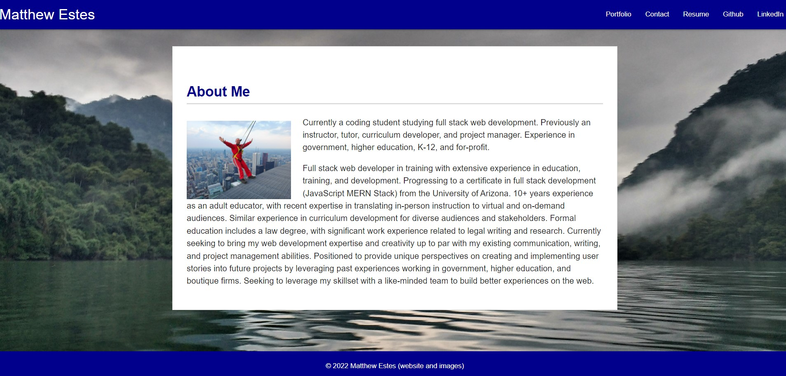
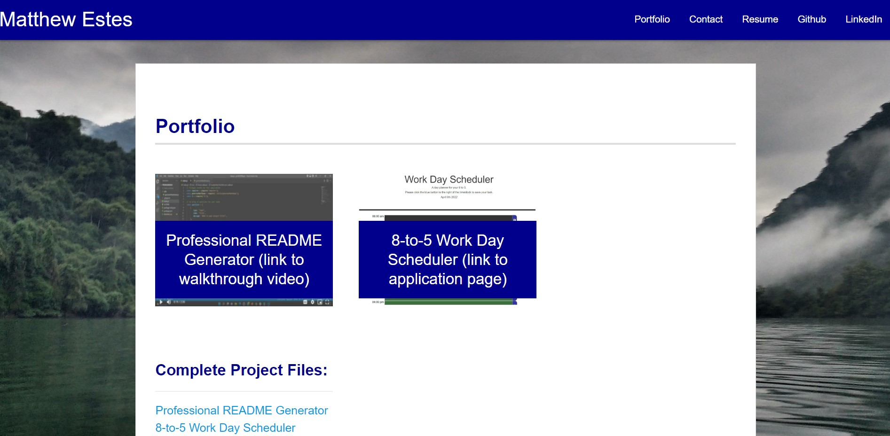

# v2proportfolio

## Homework 08: Updated Portfolio Page

This project creates a more professional portfolio page, with an eye toward being employer-competitive.

## Installation

All elements of this project are contained here: https://github.com/matthewestes33/v2proportfolio

The portfolio can be viewed here: https://matthewestes33/github.io/v2proportfolio

## Mock-Up

## Features

The user is presented with and updated portfolio page, with links to two exemplary homework assignments, and a communication page.

The user can view an updated GitHub profile, with pinned repositories two exemplary assignments.

The user can view an updated LinkedIn profile, with current activities and past education and experience listed.

The user can view an updated resume. 

The user can navigate between all pages using the navigation bar. 
